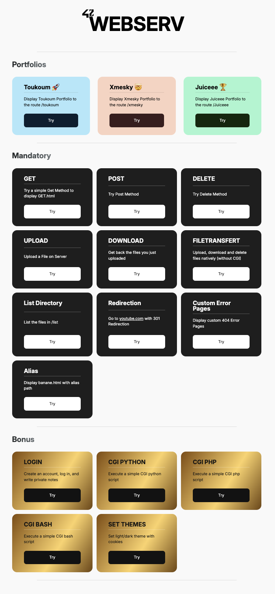
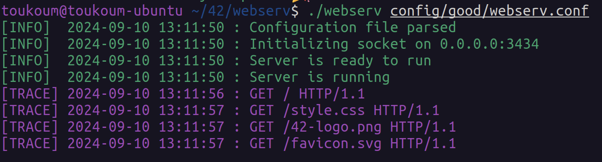
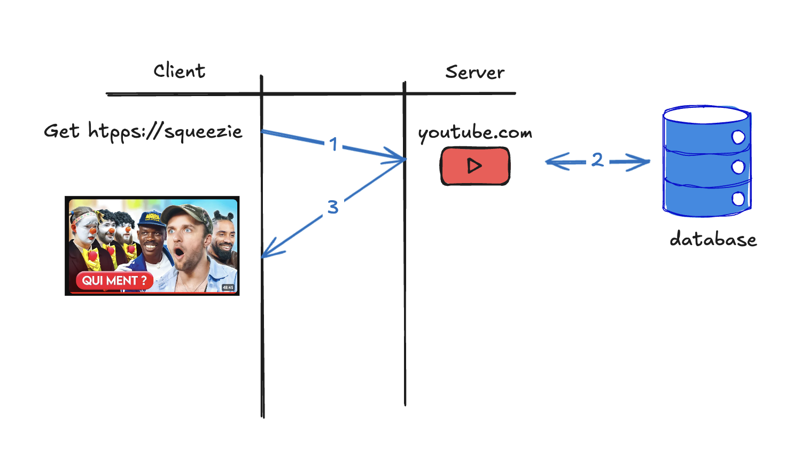
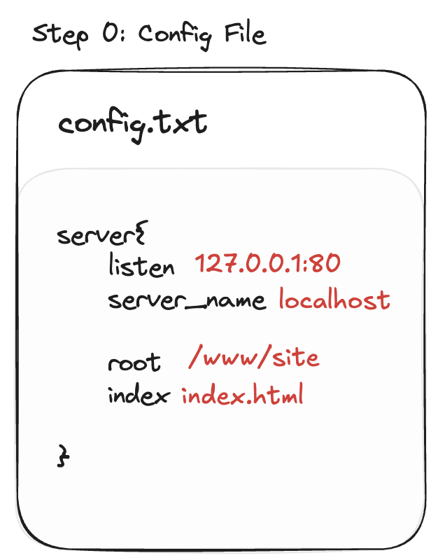
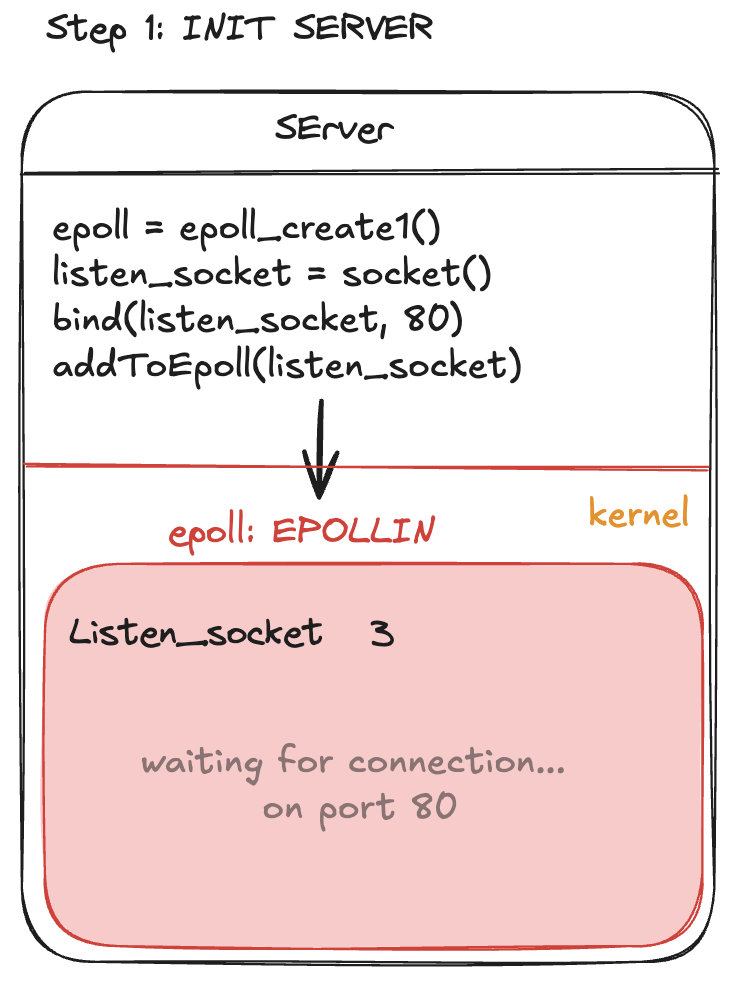
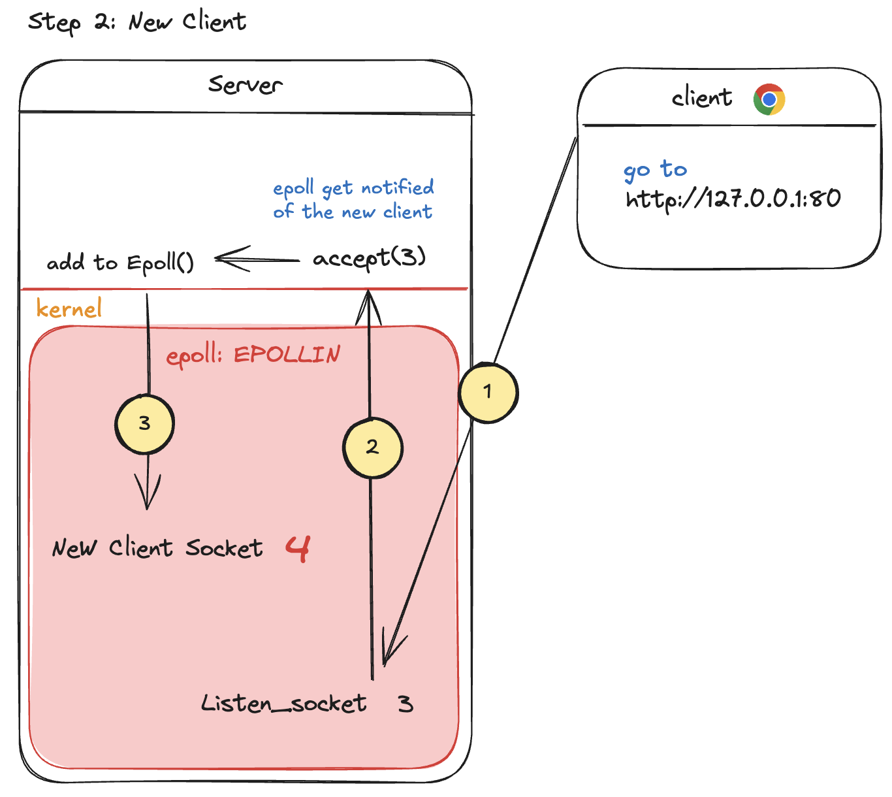
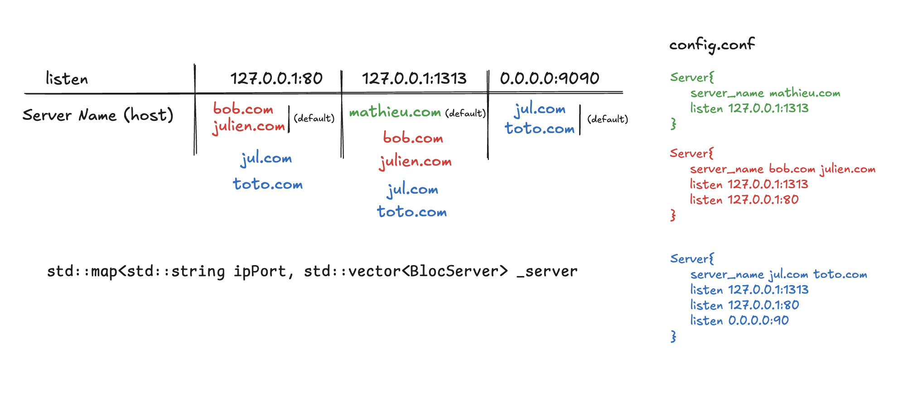
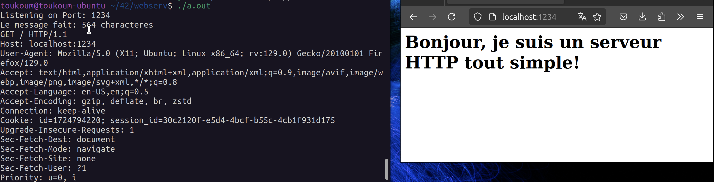

# Webserv - Serveur Web en C++98

Ce projet est un serveur HTTP code C++98 (pour LINUX). Ce serveur est compatible avec le protocole HTTP/1.1.


Demonstration: 
<a href="https://www.youtube.com/channel/UC9MxXD1D6RRVYAZxeWgCyZA"> </a>


<p align="center">

</p>

<br>




## How to use

> ⚠️ **Prérequis**: Fonctionne uniquement sur Linux. Vous devez avoir `make` et `g++` installés sur votre machine.

1. Clonez le dépôt avec 
```bash
git clone https://github.com/lxup/42Cursus-webserv.git webserv
```
3. Accédez au dépôt avec 
```bash
cd webserv
```
4. Exécutez 
```bash
make && ./webserv config/good/webserv.conf
```

5. Ouvrez un navigateur et allez sur 
```bash
http://localhost:3434
```
ou utilisez `curl http://localhost:3434`

Vous pouvez tester de modifier le fichier de configuration, en modifiant par exemple les ports d'ecoute ou les fichiers a servir.

## Objectif

L'objectif est de comprendre et d'implémenter les fonctionnalités de base d'un serveur HTTP, de la réception de requêtes à la réponse appropriée, en passant par la gestion des différents codes de statut HTTP. Il doit etre `NON BLOQUANT` (en gros on doit pouvoir servir plusieurs clients en meme temps).

<details>
<summary>🔍 Qu'est-ce que HTTP?</summary>
HTTP (Hypertext Transfer Protocol) est le protocole utilisé pour la communication entre un client (navigateur web) et un serveur. <br>
En gros quand tu te connectes a youtube.com, tu demandes plein de fichiers a un server avec des requete et le server te les renvoit



</details>

## Liens Utiles

- [Programmation Réseau via Sockets en C](https://www.codequoi.com/programmation-reseau-via-socket-en-c/) 🥇
- [The Method to epoll's Madness](https://copyconstruct.medium.com/the-method-to-epolls-madness-d9d2d6378642) 🥈
- [Tutoriel Vidéo les méthodes HTTP](https://www.youtube.com/watch?v=bs1WluLpLqE&t=1411s) 🥉

## Pipeline de notre WEBSERV

### 0️⃣ Etape 0: Analyse du Fichier de Configuration

- Analyser le fichier de configuration pour déterminer les blocs de serveurs et leurs directives.
- Créer une structure de données pour stocker les informations du fichier de configuration.


<p align="center">
  
</p>

> Sur ce schéma, on peut voir un exemple de fichier de configuration. <br>
> Le server va écouter sur le port 80. <br>
> Le root du serveur est le dossier /www/site/. <br>
> Par défaut, le serveur va servir le fichier index.html.

### 1️⃣ Etape 1: Initialisation du Serveur

- Créer un socket pour écouter les connexions entrantes. (listen socket)
- Créer une instance epoll pour surveiller les sockets.
- Ajouter le socket d'écoute à l'instance epoll.
- Attendre les événements d'entrée/sortie sur les sockets. (Avec epoll_wait())

<p align="center">
  
</p>

> Sur ce schéma, on peut voir un exemple de fichier de configuration. <br>
> Le server va écouter sur le port 80. <br>
> Le root du serveur est le dossier /www/site/. <br>
> Par défaut, le serveur va servir le fichier index.html.

> Sur ce schema, on peut voir le serveur qui ecoute sur le port 80 et qui attend des connexions entrantes.
> Le listener socket est ajoute a la Pool de epoll et a le numero 3.

### 2️⃣ Etape 2: New Client Connection

- Accepter une nouvelle connexion entrante.
- Ajouter le nouveau socket à l'instance epoll.
- Attendre les événements d'entrée/sortie sur les sockets. (Avec epoll_wait())

<p align="center">
  
</p>

> Sur ce schema, on peut voir les 3 etape de l'ajout d'un nouveau client. <br>
> 1- Le client se connecte au serveur sur le listener socket <br>
> 2- Le serveur accepte la connexion et cree un nouveau socket pour le client <br>
> 3- Le nouveau socket est ajoute a la pool de epoll et le serveur attend des evenements sur ce socket (mais aussi toujours le listener socket)


### 3️⃣ Etape 3: Requête & Response HTTP

Derniere etape (mashalla tro bo le schema)
- Un socket de connexion est present entre le client et le serveur.


> Sur ce schema, les 5 etape de la gestion de requete sont present.<br>
> 1- Le client envoie une requete au serveur sur le socket de connexion (le socket 4)<br>
> 2- Le serveur recoit la requete et comme il s'agit d'un client deja connu, il parse la requete<br>
> 3- Le serveur traite la requete, verifiant la validite de la requete, si c'est une requete chunk, un cgi, ... puis il genere une reponse<br>
> 4- Le genere la reponse en recherchant le fichier demander, en executant un cgi, ...<br>
> 5- Le serveur envoie la reponse au client sur le socket de connexion

Youpii c'est fini, le client a recu sa reponse et le serveur attend une nouvelle requete.


## Gestion des BlocServers du fichier de configuration

Le webserver doit être capable de gérer plusieurs blocs de configuration, chacun correspondant à un serveur virtuel. Chaque bloc de configuration contient des directives spécifiques qui définissent le comportement du serveur.



Le fichier config.conf montre que Webserv écoute sur 3 ports différents: **80**, **1313** et **9090**.

Pour chaque requête entrante, Webserv doit déterminer quel bloc de configuration utiliser. Voici quelques exemples :

- `http://jul.com:80` ➔ Bloc Bleu 🟦 (servername et port correspondants)
- `http://bob.com:1313` ➔ Bloc Rouge 🟥
- `http://existepas.com:1313` ➔ Bloc Vert 🟩(bloc par défaut)
- `http://nul.com:4321` ➔ Pas de réponse ⬜️ (port non écouté)

Pour repertorier tout ces `blocs server`, on a utiliser une map avec comme cle les couple ip:port et comme valeur un vecteur de blocs server. 

---

## Ressources

<details>

<summary> ✅ Fichier de Configuration du Serveur Web</summary>


Ceci est la documentation et les règles pour le fichier de configuration du serveur web. 
Ce sont des règles grandement inspirées de nginx. Nous avons adapté quelques règles à notre convenance.


### Règles Générales ⚠️

- Les lignes commençant par `#` sont des commentaires. Les commentaires doivent être sur une ligne séparée et ne peuvent pas être mélangés avec une directive.
- Il est interdit d'avoir deux blocs `location` avec le même chemin (`path`) dans un bloc `server`.
- Un bloc `server` peut contenir plusieurs `server_name` et plusieurs `listen` (`ip:port`).
- Deux blocs `server` ne peuvent pas avoir le même `server_name`.
- Deux blocs `server` peuvent partager le même `listen` (`ip:port`).

### Structure des Blocs

```plaintext
server {
    ...
    location {
        ...
    }
    ...
}
```

### Détails des Directives ✅

Le tableau ci-dessous résume les directives disponibles dans le fichier de configuration, y compris leur duplicabilité, le nombre de paramètres autorisés, et leurs valeurs par défaut.

| **Directive**            | **Bloc**        | **Duplication** | **Nb Paramètres** | **Valeur par Défaut**       | **Description**                                                                                                                                                    | **Exemple**                                           |
|--------------------------|-----------------|-----------------|-------------------|-----------------------------|--------------------------------------------------------------------------------------------------------------------------------------------------------------------|-------------------------------------------------------|
| `server`                 | N/A             | DUP             | 0                 | none                        | Définit un bloc de configuration pour un serveur web virtuel.                                                                                                       | `server { ... }`                                      |
| `location`               | `server`        | DUP             | 1                 | none                        | Définit un bloc de configuration pour une URL spécifique.                                                                                                           | `location / { ... }`                                  |
| `listen`                 | `server`        | DUP             | 1                 | `ip: 0.0.0.0 port: 80`      | Définit l'adresse IP et le port sur lequel le serveur web doit écouter les requêtes.                                                                                 | `listen 80;`, `listen 127.0.0.1:8080;`                |
| `server_name`            | `server`        | DUP             | -1                | `localhost`                 | Définit le(s) nom(s) de domaine (host) sur lequel le serveur web doit répondre.                                                                                     | `server_name louis.com;`                              |
| `error_page`             | `server`        | DUP             | -1                | `/var/www/error.html`       | Définit les pages d'erreur personnalisées. La syntaxe est stricte : `error_page CODE /path/to/file;`.                                                               | `error_page 404 /404.html;`                           |
| `root`                   | `server`/`location` | NODUP        | 1                 | `/var/www/html`             | Définit le répertoire racine du serveur web (ou du bloc location). Dans un bloc `location`, cette directive surcharge celle du bloc `server` et ne peut pas être utilisée avec `alias`. | `root /var/www/html;`                                 |
| `index`                  | `server`/`location` | DUP          | -1                | `index.html`                | Définit les fichiers index par défaut (ou du bloc location). Dans un bloc `location`, cette directive surcharge celle du bloc `server`.                             | `index index.html index.htm;`                         |
| `client_max_body_size`   | `server`        | NODUP           | 1                 | `1` (Mo)                    | Définit la taille maximale des données que le serveur web peut recevoir (en Mo).                                                                                    | `client_max_body_size 10;`                            |
| `alias`                  | `location`      | NODUP           | 1                 | none                        | Définit un alias pour un répertoire. Ne peut pas être utilisé avec `root`.                                                                                          | `alias /var/www/images/;`                             |
| `return`                 | `location`      | DUP             | 2                 | none                        | Définit une règle de réécriture d'URL.                                                                                                                              | `return 301 https://github.com/toukoum;`              |
| `autoindex`              | `location`      | NODUP           | 1                 | `off`                       | Active ou désactive l'indexation automatique des répertoires. Ne doit pas coexister avec la directive `index` dans le bloc `location`.                               | `autoindex on;`                                       |
| `allow_methods`          | `location`      | NODUP           | 0..3              | `GET DELETE POST`           | Définit les méthodes HTTP autorisées.                                                                                                                               | `allow_methods GET DELETE POST;`                      |
| `cgi_extension`          | `location`      | DUP             | 2                 | none                        | Définit l'extension qui sera mappée à un script CGI.                                                                                                                | `cgi_extension .php /var/www/cgi-bin/php-cgi;`        |
| `upload_path`            | `location`      | NODUP           | 1                 | `/var/www/upload`           | Définit le répertoire de destination des fichiers uploadés.                                                                                                         | `upload_path /var/www/images;`                        |

### Exemples de Configuration

```plaintext
server {
    listen 80;
    server_name louis.com;
    root /var/www/html;
    index index.html index.htm;
    error_page 404 /404.html;

    location / {
        root /var/www/html;
        index index.html index.htm;
    }

    location /upload {
        allow_methods POST;
        upload_path /var/www/upload;
        cgi_extension .php /var/www/cgi-bin/php-cgi;
    }
}
```
</details>


<details>
<summary> ✅ Server HTTP Ultra simplifie </summary>
Ces 50 lignes de code permettent de creer un serveur HTTP qui repond a une requete avec un message HTML. 
Attention, rien est protege dans ce code, il permet juste de montrer comment fonctionne les fonctions les plus importantes d'un serveur HTTP.

Pour essayer ce code: 
1. Rendez vous dans le dossier `simpleServer`
2. Compilez le code avec `g++ -o server simpleServer.cpp`
3. Lancez le serveur avec `./server`
4. Ouvrez un navigateur et allez sur `http://localhost:1234` / sinon vous pouvez utiliser `curl http://localhost:1234`

> Vous devrez obtenir quelque chose comme ceci:


```c++
#include <iostream>
#include <cstdlib>
#include <cstring>
#include <unistd.h>
#include <sys/socket.h>
#include <netinet/in.h>
#include <arpa/inet.h>

#define PORT 1234
#define BUFFER_SIZE 4096

int server()
{

  int fdSocket = socket(AF_INET, SOCK_STREAM, 0);

  sockaddr_in address;
  address.sin_family = AF_INET;
  address.sin_port = htons(PORT);
  address.sin_addr.s_addr = htonl(INADDR_ANY);

  bind(fdSocket, (const sockaddr *)(&address), sizeof(address));

  listen(fdSocket, 10);

  bool active = true;
  int connection;
  while (active)
  {
    unsigned long resultLen = sizeof(sockaddr);
    std::cout << "Listening on Port: " << PORT << std::endl;
    connection = accept(fdSocket, (struct sockaddr *)(&address), (socklen_t *)&resultLen);

    char buffer[BUFFER_SIZE];
    ssize_t bytesRead = read(connection, buffer, BUFFER_SIZE);
    std::cout << "Le message fait: " << bytesRead << " characteres" << std::endl;
    std::cout << buffer << std::endl;

    std::string content = "<h1>Bonjour, je suis un serveur HTTP tout simple!</h1>";
    std::string response = "HTTP/1.1 200 OK\nContent-Type: text/html\nContent-Length: " + std::to_string(content.length()) + "\n\n" + content;
    send(connection, response.c_str(), response.size(), 0);
    close(connection);
  }

  close(fdSocket);

  return (EXIT_SUCCESS);
}

int main()
{
  server();
  return 0;
}
```

Ce code permet de comprendre les principales fonctions d'un serveur HTTP. Il crée un serveur qui écoute sur le port 1234 et renvoie un message HTML simple à chaque requête.
Il utilise notamment les fonction `socket`, `bind`, `listen`, `accept`, `read` et `send` pour gérer les connexions entrantes et sortantes.

</details>

<details>
<summary> ✅ Structure d'une Requête HTTP</summary>

Une requête HTTP permet au client de demander une ressource au serveur.

1. **Ligne de Requête**  
   - **Méthode**: Action à réaliser sur le serveur (GET, POST, DELETE, etc.)
   - **URI**: Adresse de la ressource demandée sur le serveur.
   - **Version HTTP**: Version du protocole HTTP utilisée (HTTP/1.1, HTTP/1.0).

   Exemple:
   ```http
   GET /img/logo.jpg HTTP/1.0
   ```

2. **En-têtes de la Requête**  
   Paires clé-valeur fournissant des informations sur la requête ou le client.

   Exemple:
   ```http
   Host: abc.com
   Accept: text/html
   Cookie: _ga=GA1.2.407.167011
   ```

3. **Corps de la Requête** (pour POST et PUT uniquement)  
   Contient les données que le client souhaite transmettre au serveur.

   Exemple:
   ```http
   name=John+Doe&age=30&city=New+York
   ```
   au format query string
</details>


<details>
<summary> ✅ Structure d'une Réponse HTTP </summary>

La réponse HTTP est ce que le serveur renvoie après avoir reçu une requête.

1. **Ligne de Statut**  
   - **Version HTTP**
   - **Code de Statut**: Exemples courants :
     - `200 OK` : Requête traitée avec succès.
     - `404 Not Found` : Ressource introuvable.
     - `500 Internal Server Error` : Erreur interne du serveur.
   - **Message**: Phrase associée au code de statut.

   Exemple:
   ```http
   HTTP/1.1 200 OK
   ```

2. **En-têtes de Réponse**  
   Paires clé-valeur fournissant des informations sur la réponse ou le serveur.

   Exemple:
   ```http
   Content-Encoding: gzip
   Content-Length: 342
   Date: Sat, 08 Jan 2022 10:52:28 GMT
   ```

3. **Corps de la Réponse**  
   Contient la réponse elle-même, telle que la page HTML demandée.

   ``` 
   <html>
     <h1>
      Ceci est un page html
    </h1>
   </html>

</details>

<details>
<summary> ✅ EPOLL fonction() </summary>

<br>
Pour notre Webserv, nous avons choisie d’utiliser la fonction epoll(). Les autres choix qui s'offrait a nous etait select() et poll() mais epoll() est de loin la plus performante (voir le medium que j'ai link en haut de la page).


> 💡 fonction pour surveiller les des fd (sockets) afin de savoir quand les operation de Input/Output peuvent etre effectuees sans bloquer le programme.


- Comment l’utiliser ?
    
    
    ```c++
    int epoll_create(int size); // pour creer une instance et retourne le
    // fd associe
    
    int epoll_create1(int flags); // flags utile comme EPOLL_CLOEXEC 
    // qui ferme automatiquement le descripteur de epoll lors de l'execution d'un processus enfant, new version de epoll_create
    ```
    
    Une fois l’instance creer, on peut ajouter, modifier ou supprimer des descripteurs a surveiller
    
    ```c++
    int epoll_ctl(int epfd, int op, int fd, struct epoll_event *event);
    
    // epfd : Le descripteur de fichier de l'instance epoll.
    // op : L'opération à effectuer (EPOLL_CTL_ADD, EPOLL_CTL_MOD, EPOLL_CTL_DEL).
    // fd : Le descripteur de fichier à surveiller.
    // event : Une structure epoll_event qui spécifie les événements à surveiller, comme EPOLLIN (données disponibles en lecture), EPOLLOUT (prêt à écrire), etc.
    ```
    
    la structure d’event a ecouter se defini comme cela:
    
    ```c++
    struct epoll_event ev;
    ev.events = EPOLLIN; // ou EPOLLOUT out 
    ev.data.fd = server_fd;
    epoll_ctl(epfd, EPOLL_CTL_ADD, server_fd, &ev);
    
    ```
    
    - Flag d’evenements
        
        **EPOLLIN** ⇒ ****quand un fd est pret pour la lecture (ya des truc a lire sur le socket)
        
        **EPOLLOUT** ⇒ quand un fd est pret pour l’ecriture (en gros tu peux envoyer ta requete http sans que l’appel de send() soit bloquant)

        **EPOLLERR** ⇒ quand un fd a une erreur (ex: connection reset)

        **EPOLLHUP** ⇒ quand un fd est ferme par l’autre cote (ex: le client ferme son navigateur)
        

        nous pour webserv on va utiliser la combinaison de **EPOLLIN + EPOLLOUT**
        
    
    Pour recevoir une “notification” quand un evenement arrive:
    
    ```c++
    int epoll_wait(int epfd, struct epoll_event *evlist, int maxevents, int timeout);
    // evlist : Un tableau pour stocker les événements prêts.
    // maxevents : Le nombre maximal d'événements à traiter.
    // timeout : Temps en millisecondes pour bloquer l'attente.
    ```
    epoll_wait bloquera jusqu'à ce qu'un événement se produise ou
     jusqu'à ce que le délai expire. 
     Si timeout est -1, il attend indéfiniment.
</details>

<details>
<summary> ✅ Requêtes Chunked et Délimitation </summary>

Les requêtes chunked permettent d'envoyer des données en plusieurs morceaux de taille variable.

<details>
<summary> Fonctionnement des Requêtes Chunked</summary>
Chaque chunk suit le format : `[taille du chunk en hexadécimal]\r\n[données du chunk]\r\n`. La fin de la transmission est indiquée par `0\r\n\r\n`.
Exemple de chunk:
```http
4\r\nWiki\r\n
5\r\npedia\r\n
0\r\n\r\n
```
</details>


### Délimitation des Requêtes HTTP

Une requête HTTP standard se termine soit :
- Par une ligne vide après les en-têtes (si aucun corps n'est présent).
- Par la réception de l'intégralité des données spécifiées par `Content-Length`.
- Par le chunk de fin (pour les requêtes chunked).

</details>


<details>
<summary> ✅ Codes de Statut HTTP </summary>

Les codes de statut HTTP indiquent le résultat d'une requête HTTP.

- 🔵 **1xx : Informational** - Requête reçue, traitement en cours.
- 🟢 **2xx : Success** - Requête reçue, comprise et acceptée avec succès.
- 🟡 **3xx : Redirect** - Une action supplémentaire doit être effectuée pour compléter la requête.
- 🔴 **4xx : Client Error** - La requête contient une erreur qui empêche le serveur de la traiter.
- ⚫️ **5xx : Server Error** - Le serveur a échoué à traiter une requête apparemment valide.

</details>
